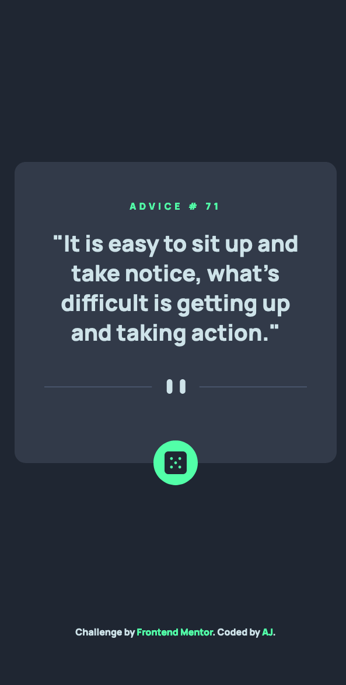
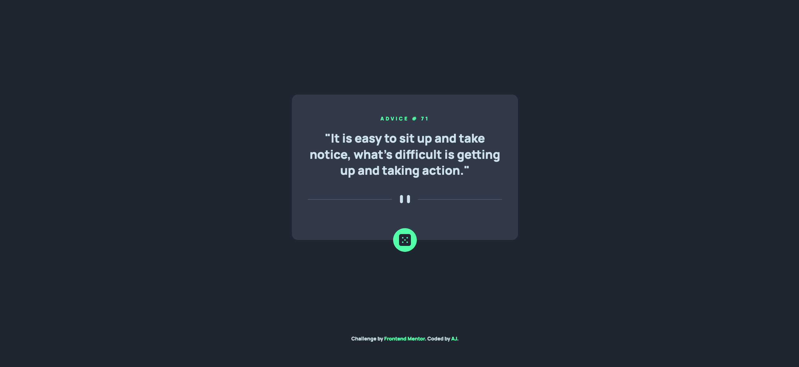

# Frontend Mentor - Products preview card component solution

This is a solution to the [Advice generator app challenge on Frontend Mentor](https://www.frontendmentor.io/challenges/advice-generator-app-QdUG-13db). Frontend Mentor challenges help you improve your coding skills by building realistic projects.

## Table of contents

- [Overview](#overview)
  - [The challenge](#the-challenge)
  - [Screenshot](#screenshot)
  - [Links](#links)
- [My process](#my-process)
  - [Built with](#built-with)
  - [What I learned](#what-i-learned)
  - [Continued development](#continued-development)
  - [Useful resources](#useful-resources)
- [Author](#author)
- [Acknowledgments](#acknowledgments)

## Overview

I am learning Tailwind CSS so built this using tailwind css.

### The challenge

Users should be able to:

- View the optimal layout for the app depending on their device's screen size
- See hover states for all interactive elements on the page
- Generate a new piece of advice by clicking the dice icon

### Screenshot

The screenshot for the mobile view:



The screenshot for desktop view:



### Links

- Solution URL: [Products preview card](https://github.com/gtalin/front-end-mentor/advice-generator-app)
- Live Site URL: [Products preview card](https://gtalin.github.io/front-end-mentor/advice-generator-app)

## My process

### Built with

- Semantic HTML5 markup
- Mobile-first workflow
- [Tailwind CSS](https://tailwindcss.com/)

### What I learned

1. Using an image as background for an element.

To get pattern that is used after the quote, I used a `div` and used the pattern as a background image. Doing so in css is fairly straighforward. But had never done it in tailwind css.

We can add it in the tailwind config file and it can be some as follows:

```js
module.exports = {
  theme: {
    extend: {
      backgroundImage: {
        'mobile-divider': "url('/build/img/pattern-divider-mobile.svg')",
        'desktop-divider': "url('/build/img/pattern-divider-desktop.svg')",
      },
    },
  },
};
```

We can also use it without adding to tailwind config file as follows: `<div class="bg-[url('/img/hero-pattern.svg')]">`

2. Learned several ways of placing and centering an image inside a button.

What I started off as was placing image inside a button using pseudo element rather than a child `img` element and the challenges with centering it.

If we use a child element inside `button` then we can use flex to center it. But if we use a pseudo element like `:after` we have to use a different method to center the element.

We can center an element inside another element by

```css
.tallButton{
   position:relative;
   width:200px;
   height:200px;
}

.tallButton img {
  position:absolute;
  top: 50%;
  left:50%;
  transform: translate(-50%, -50%);
```

This is for when an image is a child element of button. We can even use flexbox to center image in that case.

However we used a pseudo element. For that, `transform: translate(-50%, -50%);` does not work. We need to hard code the `translate-x` and `translate-y` values.

Centering image inside button when the image is a pseudo element:

```html
<button
  class="w-12 h-12 relative rounded-full bg-primary-neon-green after:content-link after:m-0 after:absolute after:top-[50%] after:left-[50%] transform after:-translate-x-[12px] after:-translate-y-[12px]"
></button>
```

In tailwind config file, we have to extend `content` property so that we can use a url. As per the [tailwind docs](https://tailwindcss.com/docs/content#customizing-your-theme)

```js
extend: {
content: {
        'link': 'url("/build/img/icon-dice.svg")',
      },
}
```

We could also have used image as a background image for button.
`<button class="centered-img"></button>`

```css
.centered-img {
  background-image: url('./dice-icon.svg');
  background-position: center;
  background-repeat: no-repeat;
  background-size: contain;
}
```

3. Add transition to advice text. Used opacity for it.
   Like mentioned in the [SO link](https://stackoverflow.com/questions/29640486/is-there-any-way-to-have-a-transition-effect-when-changing-the-innerhtml)

4. Get background images to work with github pages. [This](https://github.com/tailwindlabs/tailwindcss/discussions/5504) link helped in that regard. Though we're making the entry in the `tailwind.config.js` file, the path for the image should be such that it is with respect to the built css file. Previously I was using a path like `/build/img/icon.svg` which worked with the local server but with github pages it was trying to access the path in `https://gtalin.github.io/build/img/icon.svg`.

### Continued development

Would like to do more projects using tailwindcss.

### Useful resources

- [Stack overflow](https://stackoverflow.com/questions/7274875/center-image-in-html-button) - link to center image inside a button. They used an image tag instead of a psuedo element.
- [Tailwind docs](https://tailwindcss.com/docs/background-image#using-custom-values) - Using an image as a background for an element.
- [Background image](https://github.com/tailwindlabs/tailwindcss/discussions/5504)

## Author

- Website - [AJ](https://github.com/gtalin)
- Frontend Mentor - [@gtalin](https://www.frontendmentor.io/profile/gtalin)
- Twitter - [@gtalinn](https://twitter.com/gtalinn)

## Acknowledgments

Learned a lot from the several yotube resources listed above.
