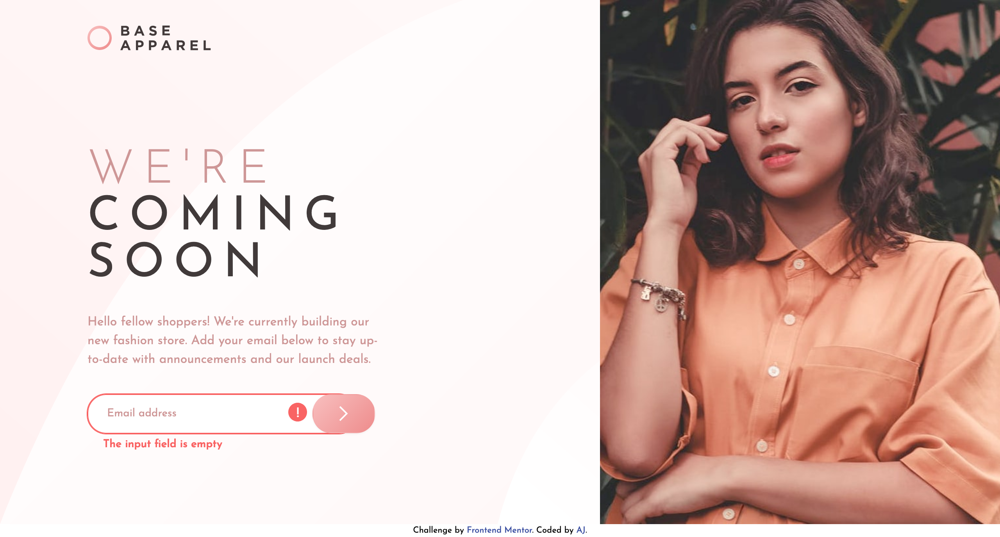

# Frontend Mentor - Base Apparel coming soon page solution

This is a solution to the [Base Apparel coming soon page challenge on Frontend Mentor](https://www.frontendmentor.io/challenges/base-apparel-coming-soon-page-5d46b47f8db8a7063f9331a0). Frontend Mentor challenges help you improve your coding skills by building realistic projects.

## Table of contents

- [Overview](#overview)
  - [The challenge](#the-challenge)
  - [Screenshot](#screenshot)
  - [Links](#links)
- [My process](#my-process)
  - [Built with](#built-with)
  - [What I learned](#what-i-learned)
  - [Continued development](#continued-development)
  - [Useful resources](#useful-resources)
- [Author](#author)
- [Acknowledgments](#acknowledgments)

## Overview

I am learning Tailwind CSS so built this using tailwind css.

### The challenge

Users should be able to:

- View the optimal layout for the site depending on their device's screen size
- See hover states for all interactive elements on the page
- Receive an error message when the `form` is submitted if:
  - The `input` field is empty
  - The email address is not formatted correctly

### Screenshot

The screenshot for desktop view:



### Links

- Solution URL: [3 column preview card](https://github.com/gtalin/front-end-mentor/base-apparel-coming-soon)
- Live Site URL: [3 column preview card](https://gtalin.github.io/front-end-mentor/base-apparel-coming-soon)

## My process

### Built with

- Semantic HTML5 markup
- Mobile-first workflow
- [Tailwind CSS](https://tailwindcss.com/)
- CSS Flexbox
- CSS Grid

### What I learned

- Custom gradient tailwind css
  Tailwind has a lot of inbuilt gradients (to right, to left, to bottom right etc) however it does not have a gradient option where we can _specify an angle_.

  So for that we need to create a custom gradient in `tailwind.config.js`. [Link ](https://stackoverflow.com/questions/67344478/how-to-apply-background-image-with-linear-gradient-in-tailwind-css) for custom background tailwind css.

```js
module.exports = {
  theme: {
    extend: {
      backgroundImage: {
        'custom-gradient-1':
          'linear-gradient(135deg, hsl(0, 0%, 100%), hsl(0, 100%, 98%))',
        'custom-gradient-2':
          'linear-gradient(135deg, hsl(0, 80%, 86%), hsl(0, 74%, 74%))',
      },
    },
  },
  variants: {},
  plugins: [],
};
```

For a background with a background image and a linear gradient, we can do:

```js
{'custom-grad-img': 'url("./img/bg-pattern-desktop.svg"), linear-gradient(135deg, hsl(0, 0%, 100%), hsl(0, 100%, 98%))'}
```

- Accessible link with image inside. Tailwind has a built in class called `sr-only` we can put a `span` inside our `a` tag to give a full description of what the link is and use `sr-only` on it.
  Another option which I have used before was `aria-label` on the link and `aria-hidden` on the image. [This link](https://www.sarasoueidan.com/blog/accessible-icon-buttons) by Sara Soueidan lists various ways of making buttons accessible (they have `svg` insetad of `img` and `button` instead of `a`)
  There might be cases where if the Logo fails to load we want to show a message `base apparel logo` that is the `alt` text. However for assistive technologies we want the screen reader to read `goto home`. Hence using `aria-label` (on `a` or a `span` with `sr-only`) inspite of having `alt` tag on the `img` with `aria-hidden="true"` might make sense.
  If the `alt` tag and the `aria-label` were conveying the same information, we wouldn't need `aria-label` or `span` with `sr-only`. Like the `W3C` example above which we have also used in our case with the logo.

  Our example of logo inside a link fall in the category of [Functional images](https://www.w3.org/WAI/tutorials/images/functional/).

  ```html
  <a href="https://www.w3.org/">
    
  </a>
  ```

  The `alt` tag in that case should convey the functinality of the link whcih is to link to the home page. Hence the `alt` tag is: `W3C home`
  The link has several use cases of images being used with links and buttons (with and without text).
  NOTE: if we embed an `svg` logo, then it is best to follow one of [these](https://www.sarasoueidan.com/blog/accessible-icon-buttons) methods for accessibility.

- Role of `img` can be give to a `div`. One sample use case for it [is](https://www.w3.org/WAI/GL/wiki/Using_aria-labelledby_to_provide_a_text_alternative_for_non-text_content):

```html
<div role="img" aria-labelledby="star_id">
  
  
  
  
  
</div>

<div id="star_id">4 of 5</div>
```

As per [MDN](https://developer.mozilla.org/en-US/docs/Web/Accessibility/ARIA/Roles/img_role)

> The ARIA `img` role can be used to identify multiple elements inside page content that should be considered as a single image. These elements could be images, code snippets, text, emojis, or other content that can be combined to deliver information in a visual manner.

- In the form, made the error icon as a pseudo-element of the `button` to position it wrt to the button (cannot make it a pseudo element of `input` because pseudo elements are applied inside container elements and `input` is not one such element).
- For the error message, made it an absolute element. If we do not make it an absolute element, when we remove `hidden` from the field, it is causing change in layout (in particular for side by side layout of image and text, it is causeing an increase in the height of the image)

### Continued development

Would like to do more projects using tailwindcss. Would also like to focus more on accessibility.

### Useful resources

- [Tailwind docs](https://tailwindcss.com/docs/)
- [custom backgrounds tailwind](https://stackoverflow.com/questions/67344478/how-to-apply-background-image-with-linear-gradient-in-tailwind-css) In this link they have a background image as well as a linear gradient. Customised it for our example
- [Accessible link with image inside](https://stackoverflow.com/questions/35202809/image-inside-a-link-for-accessible-users) - The stack overflow link point to a [W3C](https://www.w3.org/TR/WCAG20-TECHS/C7.html) link.
- [Accessible buttons](https://www.sarasoueidan.com/blog/accessible-icon-buttons)
- [Accessible images](https://accessibility.huit.harvard.edu/describe-content-images)
- [Images and accessibility W3C](https://www.w3.org/WAI/tutorials/images/tips/)
- [Alt decision tree](https://www.w3.org/WAI/tutorials/images/decision-tree/)
- [img role](https://developer.mozilla.org/en-US/docs/Web/Accessibility/ARIA/Roles/img_role) - only some elements can take the role of `img`. `Picture` is not one of those.
- [aria-label MDN](https://developer.mozilla.org/en-US/docs/Web/Accessibility/ARIA/Attributes/aria-label)
- [Functional images](https://www.w3.org/WAI/tutorials/images/functional/) - Logo inside a link or image used as button falls in this category.
- [pseudo element on input field](https://stackoverflow.com/questions/2587669/can-i-use-a-before-or-after-pseudo-element-on-an-input-field)

## Author

- Website - [AJ](https://github.com/gtalin)
- Frontend Mentor - [@gtalin](https://www.frontendmentor.io/profile/gtalin)
- Twitter - [@gtalinn](https://twitter.com/gtalinn)

## Acknowledgments

Learned a lot from the several resources listed above.
