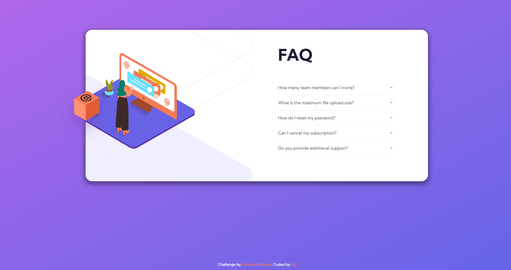

# Frontend Mentor - FAQ Accordion Card solution

This is a solution to the [FAQ Accordion Card solution](https://www.frontendmentor.io/challenges/faq-accordion-card-XlyjD0Oam). Frontend Mentor challenges help you improve your coding skills by building realistic projects.

## Table of contents

- [Overview](#overview)
  - [The challenge](#the-challenge)
  - [Screenshot](#screenshot)
  - [Links](#links)
- [My process](#my-process)
  - [Built with](#built-with)
  - [What I learned](#what-i-learned)
  - [Continued development](#continued-development)
  - [Useful resources](#useful-resources)
- [Author](#author)
- [Acknowledgments](#acknowledgments)

## Overview

I am learning Tailwind CSS so built this using tailwind css.

### The challenge

Your users should be able to:

- View the optimal layout for the component depending on their device's screen size
- See hover states for all interactive elements on the page
- Hide/Show the answer to a question when the question is clicked

### Screenshot

The screenshot for desktop view:

The screenshot for mobile view:

### Links

- Solution URL: [FAQ accordion card](https://github.com/gtalin/front-end-mentor/faq-accordion-card)
- Live Site URL: [FAQ accordion card](https://gtalin.github.io/front-end-mentor/faq-accordion-card)

## My process

### Built with

- Semantic HTML5 markup
- Mobile-first workflow
- [Tailwind CSS](https://tailwindcss.com/)
- CSS Flexbox
- CSS Grid

### What I learned

Consulted a few links to find out the correct semantic HTML to use for accordions.

Based my `html` on this [link](https://www.sarasoueidan.com/blog/accordion-markup/).

Used a `ul` and `li` combination.
And inside `li` for questions used `h3` and `button` and for answers used `div` and `p`

We have used a decorative illustration image. So set the alt tag for it as empty. As per this [link](https://www.w3.org/WAI/tutorials/images/decorative/).

### Continued development

Would like to do more projects using tailwindcss. Would also like to focus more on accessibility.

### Useful resources

- [Tailwind docs](https://tailwindcss.com/docs/)
- [Semantic accordion markup](https://www.sarasoueidan.com/blog/accordion-markup/)
- [Accessible Aria Accordions](https://www.scottohara.me/blog/2017/10/25/accordion-release.html)
- [native html accordion](https://nikitahl.com/native-html-accordion) This implementation uses details and summary to implement an FAQ. There is no way to add animate the transition of the open and closed states (there are some work arounds where we can animate the contents inside the details).
- [Inclusive collapsible sections](https://inclusive-components.design/collapsible-sections/) - good for markup and aria.
- [Change size of image in pseudo element](https://stackoverflow.com/questions/8977957/can-i-change-the-height-of-an-image-in-css-before-after-pseudo-elements)

## Author

- Website - [AJ](https://github.com/gtalin)
- Frontend Mentor - [@gtalin](https://www.frontendmentor.io/profile/gtalin)
- Twitter - [@gtalinn](https://twitter.com/gtalinn)

## Acknowledgments

Learned a lot from the several resources listed above.
