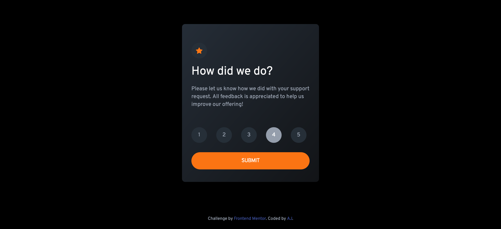
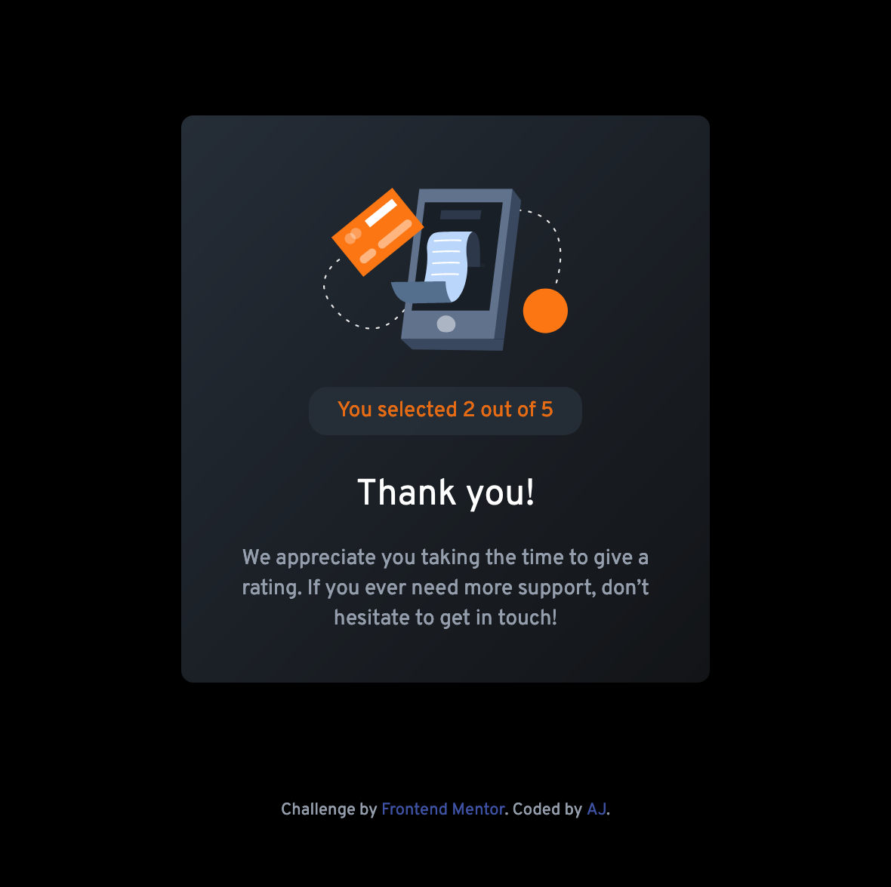

# # Frontend Mentor - Interactive rating component solution

This is a solution to the [Interactive rating component challenge on Frontend Mentor](https://www.frontendmentor.io/challenges/interactive-rating-component-koxpeBUmI). Frontend Mentor challenges help you improve your coding skills by building realistic projects.

## Table of contents

- [Overview](#overview)
  - [The challenge](#the-challenge)
  - [Screenshot](#screenshot)
  - [Links](#links)
- [My process](#my-process)
  - [Built with](#built-with)
  - [What I learned](#what-i-learned)
  - [Continued development](#continued-development)
  - [Useful resources](#useful-resources)
- [Author](#author)
- [Acknowledgments](#acknowledgments)

## Overview

I am learning Tailwind CSS so built this using tailwind css.

### The challenge

Users should be able to:

- View the optimal layout for the app depending on their device's screen size
- See hover states for all interactive elements on the page
- Select and submit a number rating
- See the "Thank you" card state after submitting a rating

### Screenshot

The screenshot for the mobile view (with some active states highlighted):

The screenshot for the desktop view (with some elements in active state):

Screenshot for the thank you state:

### Links

- Solution URL: [Products preview card](https://github.com/gtalin/front-end-mentor/interactive-rating-component)
- Live Site URL: [Products preview card](https://gtalin.github.io/front-end-mentor/interactive-rating-component/index.html)

## My process

### Built with

- Semantic HTML5 markup
- Mobile-first workflow
- [Tailwind CSS](https://tailwindcss.com/)

### What I learned

There was a lot to learn in this project. It had several seemingly small elements that needed work. There was quite few challenges and learnings:

- Using the correct type of element for ratings. Styling a `div` is lot less challenging but it is not semantically meaningful and the component would not be accessible (at least not without writing a fair bit of code to make it accessible). I used a form with radio input for the ratings part because it is semantically more meaningful.

- Styling radio input in a way that that doesn't break accessiblity that comes with radio buttons out of the box. This part definitely took the longest. But I had found this [resource](https://moderncss.dev/pure-css-custom-styled-radio-buttons/) for styling radio buttons which helped immensely.
  In many links to customise radio buttons, they use the property `display:none` for `input[type="radio"]`. Such radio buttons cannot be navigated to by just the keyboard. They are not accessible. The [moderncss](https://moderncss.dev/pure-css-custom-styled-radio-buttons/) example used `appearance:none`. The `appearance:none` property also has good browser support.

- Changing style of the labels for the radio buttons. This was more of a tailwind css related challenge for me. In CSS there is a clear way to target the next sibling using `+`. Like so: `input[type="radio"]:checked + label {}`. In tailwind it is done using the `peer-*` variant which was introduced in `v.2` of tailwind. [Tailwindcss peer variant](https://v2.tailwindcss.com/docs/just-in-time-mode#sibling-selector-variants).

- Another tailwind related challenge was using the `:not` selector in tailwind css. We used the `:focus` and `:hover` pseudo class to change the color of the radio input (to the primary color that was specified). However we want that color to be applied only when the radio input is not checked. In CSS it is quite simple. We chain selectors like so: `.radio-input:not(:checked):focus` and `.radio-input:not(:checked):hover`. However I had to do a fair amount of searching to find out how we can do something like that in tailwind css. In tailwind css it is [done](https://www.kindacode.com/snippet/using-not-selector-in-tailwind-css/) `[&:not(input:checked)]:focus:bg-primary`. Even after finding the above resource for using `:not`, I was using is wrong. We need to use a selector with `:not` like `p` or `input` I was using a pseudo class `:checked` and its variant `checked` rather than `input:checked`. When I could not get it to work and was writing custom css for it did I realise my mistake. But I had to spent a fair amount of time on this. Just using custom CSS would've been a lot faster. But in the end I did learn something new.

- Implementing interactivity with JS. Added animation effect for cards using `translate-x` property so that the thank you card appears to slide in. Experimented a bit with this. Initially used a slide out animation for ratings card and a slide in animation for the thank you card. But it was looking a little distracting. A better effect was to just hide the ratings card and let the thank you card slide in.

### Continued development

Would like to do more projects using tailwindcss. Would also like to do landing pages and single page layouts along with single components.

### Useful resources

- [Modern css](https://moderncss.dev/pure-css-custom-styled-radio-buttons/) - Custom styled radio buttons which are accessible.
- [SO](https://stackoverflow.com/questions/65784357/tailwindcss-change-label-when-radio-button-checked) - The peer class and how to use it. To change the styling of `label` when `input` is `:checked`.
- [:not selector tailwindcss](https://www.kindacode.com/snippet/using-not-selector-in-tailwind-css/) - Using the `:not` selector in tailwind css is a little different from how we normally use pseudo classes like `:checked` and `:hover` etc in tailwind css.

## Author

- Website - [AJ](https://github.com/gtalin)
- Frontend Mentor - [@gtalin](https://www.frontendmentor.io/profile/gtalin)
- Twitter - [@gtalinn](https://twitter.com/gtalinn)

## Acknowledgments

Learned a lot from the several yotube resources listed above.
