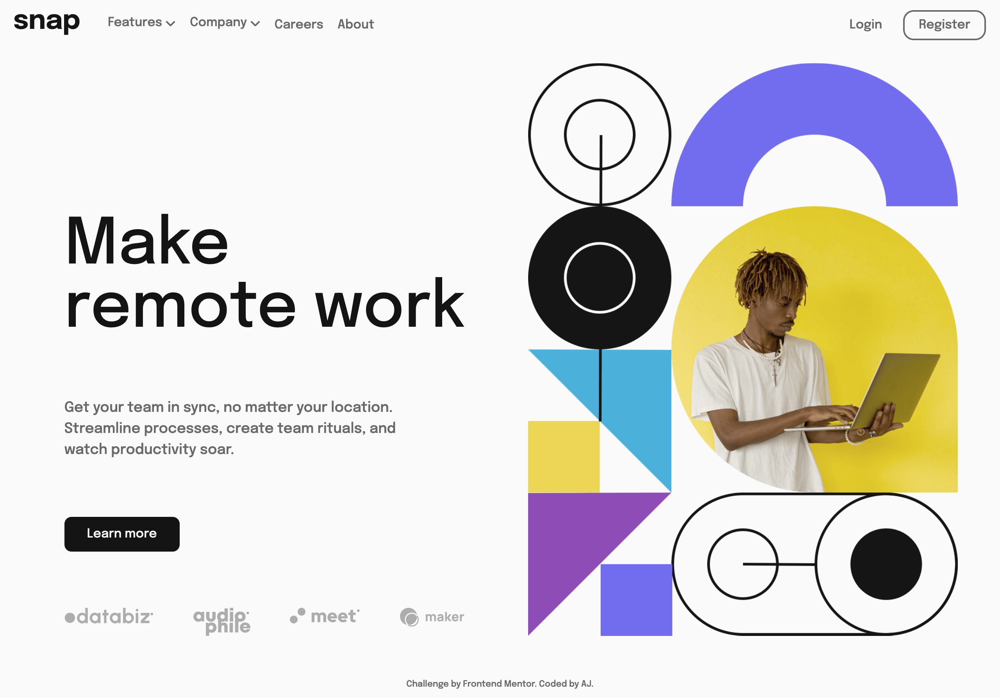
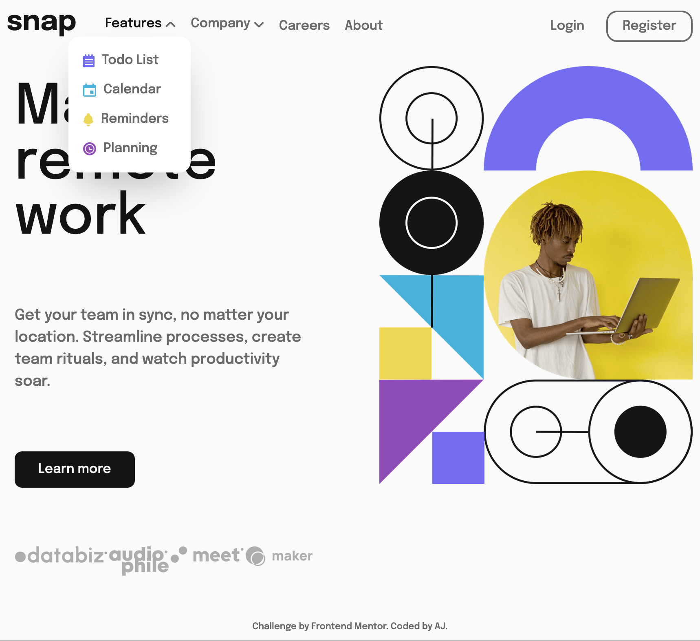

# Frontend Mentor - Products preview card component solution

This is a solution to the [Intro section with dropdown navigation challenge on Frontend Mentor](https://www.frontendmentor.io/challenges/intro-section-with-dropdown-navigation-ryaPetHE5). Frontend Mentor challenges help you improve your coding skills by building realistic projects.

## Table of contents

- [Overview](#overview)
  - [The challenge](#the-challenge)
  - [Screenshot](#screenshot)
  - [Links](#links)
- [My process](#my-process)
  - [Built with](#built-with)
  - [What I learned](#what-i-learned)
  - [Continued development](#continued-development)
  - [Useful resources](#useful-resources)
- [Author](#author)
- [Acknowledgments](#acknowledgments)

## Overview

I am learning Tailwind CSS so built this using tailwind css.

### The challenge

Users should be able to:

- View the relevant dropdown menus on desktop and mobile when interacting with the navigation links
- View the optimal layout for the content depending on their device's screen size
- See hover states for all interactive elements on the page

### Screenshot

The screenshot for desktop view:



The screenshot for the mobile view:


The screenshot for the desktop view with dropdown:



### Links

- Solution URL: [Products preview card](https://github.com/gtalin/front-end-mentor/intro-section-dropdown-nav)
- Live Site URL: [Products preview card](https://gtalin.github.io/front-end-mentor/intro-section-dropdown-nav)

## My process

### Built with

- Semantic HTML5 markup
- Mobile-first workflow
- [Tailwind CSS](https://tailwindcss.com/)

### What I learned

In tailwind css if we want to change the property of some element based on hover for parent, we add `group` class to parent and then use something called `group-hover`.
Found it [here](https://stackoverflow.com/questions/65946335/how-to-make-parent-div-activate-styling-of-child-div-for-hover-and-active).

```html
<button class="group hover:text-neutral-black">
  Features
  <span
    aria-label="expand"
    class="inline-block w-3 h-1.5 bg-no-repeat bg-center bg-cover bg-arrow-down transition group-hover:bg-arrow-up group-focus:bg-arrow-up"
  ></span>
</button>
```

This property came in handy because we want to change the icon based on parent. It also came in handy for showing the `sub-menu` when we hover over it's parent.
Initially I was using `peer` class on `button` and then using `peer-hover` on the `sub-menu`. However as soon as we hover over the `sub-menu`, we're no longer hovering over the `button` hence the `sub-menu` disappears. So we need to use `group` class on `li` which is parent for the `button` as well as `sub-menu`. Using that, we can see the `sub-menu`.

As follows:

```html
<li class="group text-neutral-gray transition mr-4 text-sm relative">
  <button class="peer hover:text-neutral-black">
    Features
    <span
      aria-label="expand"
      class="inline-block w-3 h-1.5 bg-no-repeat bg-center bg-cover bg-arrow-down transition group-hover:bg-arrow-up "
    ></span>
  </button>
  <ul
    class="submenu absolute top-6 -left-10 space-y-3 bg-white p-4 rounded-xl shadow-2xl z-1 w-[150px] hidden opacity-0 group-hover:block group-hover:opacity-100"
  >
    <ul></ul>
  </ul>
</li>
```

The `sub-menu` is now visible even when we `hover` over it and remove `hover` from `button`. With `peer-hover`, the `submenu` disappeared as soon as we remove `hover` state from `button`.

The `submenu` is still not tabbable though. Need to resolve that next.

**Tabbable submenu**

Found [this](https://css-tricks.com/solved-with-css-dropdown-menus/) resource to make tabbable sub-menu.
We need to use the `focus-within` selector like so: `li:focus-within > ul`

We use it for arrow icon: `group-focus-within:bg-arrow-up` and then for `ul` as well. Like so `group-focus-within:block group-focus-within:opacity-100`.

**flex-grow**

In the header we have to use `flex-grow:1` on the `nav` because the parent `div` has the site logo and `nav` and when we apply `flex` to it, the children (ie. logo and nav) will [only be as wide as their contents](https://stackoverflow.com/questions/50455838/flexbox-not-full-width) and will align left. Which is not what we want. We want the `nav` to occupy full width and the 2 parts of the nav should be left aligned and right aligned respectively.

**Make the header and buttons with images more accessible**

- [accessible buttons](https://www.sarasoueidan.com/blog/accessible-icon-buttons)
  For hamburger menu and closing of the menu, we use a button with an icon inside of it. Not having a text inside a button will make it in-accessible for screen readers. Several ways we can create an accessible button are covered in the article above. One such way is including text in a span and then hiding it for visual user (so that it will be for screen readers only. We use CSS for hiding the text).
  And adding `aria-hidden="true"` for the image to hide it from screen readers.

  Yet another technique is to add `hidden` attribute to the text `span` to hide the text for visual users and then use `aria-labelledby` to the button and point it to the text. The image would still be `aria-hidden="true"`
  The article is a treasure trove of information about how to make a button accessible.

- [accessible mobile nav](https://www.a11ymatters.com/pattern/mobile-nav/)
  We should not hide `nav`. The menu icon button we use should be inside `nav` and we should hide `ul` raher than the whole `nav`. If we hide the whole `nav` then the `nav` will not be announced by screen readers and hence not accessible.
  The article also goes on to explain how the menu should be visible for people with JS disabled.

  This article suggests a method to make accessible buttons. It is the same as the first method suggested in [Sara's](https://www.sarasoueidan.com/blog/accessible-icon-buttons/#site-header) article. By giving the button a `span` with text which is hidden visually and then using `background` property to add icon to button.

### Continued development

Would like to do more projects using tailwindcss. Would also like to focus more on accessibility.

### Useful resources

- [Tailwind docs](https://tailwindcss.com/docs/)
- [Group hover](https://stackoverflow.com/questions/65946335/how-to-make-parent-div-activate-styling-of-child-div-for-hover-and-active)
- [Tabbable dropdown menu](https://css-tricks.com/solved-with-css-dropdown-menus/)
- [accessible mobile nav](https://www.a11ymatters.com/pattern/mobile-nav/)
- [accessible buttons](https://www.sarasoueidan.com/blog/accessible-icon-buttons)

## Author

- Website - [AJ](https://github.com/gtalin)
- Frontend Mentor - [@gtalin](https://www.frontendmentor.io/profile/gtalin)
- Twitter - [@gtalinn](https://twitter.com/gtalinn)

## Acknowledgments

Learned a lot from the several resources listed above.
