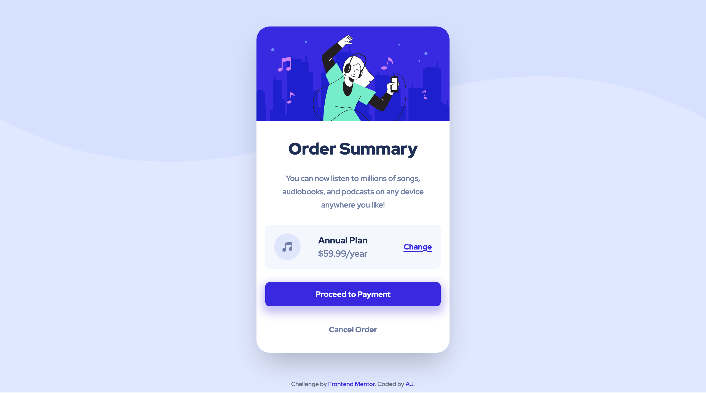

# Frontend Mentor - Order summary card solution

This is a solution to the [Order summary card challenge on Frontend Mentor](https://www.frontendmentor.io/challenges/order-summary-component-QlPmajDUj). Frontend Mentor challenges help you improve your coding skills by building realistic projects.

## Table of contents

- [Overview](#overview)
  - [The challenge](#the-challenge)
  - [Screenshot](#screenshot)
  - [Links](#links)
- [My process](#my-process)
  - [Built with](#built-with)
  - [What I learned](#what-i-learned)
  - [Continued development](#continued-development)
  - [Useful resources](#useful-resources)
- [Author](#author)
- [Acknowledgments](#acknowledgments)

## Overview

I am learning Tailwind CSS so built this using tailwind css.

### The challenge

Users should be able to:

- See hover states for interactive elements

### Screenshot

The screenshot for desktop view:

The screenshot for the mobile view:

### Links

- Solution URL: [Order summary component](https://github.com/gtalin/front-end-mentor/order-summary-component)
- Live Site URL: [Order summary component](https://gtalin.github.io/front-end-mentor/order-summary-component)

## My process

### Built with

- Semantic HTML5 markup
- Mobile-first workflow
- [Tailwind CSS](https://tailwindcss.com/)
- Mobile-first workflow

### What I learned

To get the wave pattern in the background, we use the `before` pseudo element. However I was unable to change the size of the image. When the image was too large, I had set an `overflow-x` property on the body to prevent a horizontal scroll caused by the large image. However for very large screens, the image was a bit too small and the right half of the screen was left blank.

This problem was because I was using the `content` property to display the image. A better option is to use the `background` property to display the message. For that we'll have to set a width and height for the `before` pseudo element. But we get more control over the dimension of the image. The [link](https://teamtreehouse.com/community/unable-to-resize-images-created-using-the-before-pseudoelement) for this.

If we use `background` property instead of `content` property, we have a lot more control. We can use `background-size` and `background-position` properties to determine which part of the wave pattern we want to show.

### Continued development

Would like to do more projects using tailwindcss. Would also like to focus more on accessibility.

### Useful resources

- [Tailwind docs](https://tailwindcss.com/docs/)
- [Size of images in before pseudo element](https://teamtreehouse.com/community/unable-to-resize-images-created-using-the-before-pseudoelement)

## Author

- Website - [AJ](https://github.com/gtalin)
- Frontend Mentor - [@gtalin](https://www.frontendmentor.io/profile/gtalin)
- Twitter - [@gtalinn](https://twitter.com/gtalinn)

## Acknowledgments

Learned a lot from the several resources listed above.
