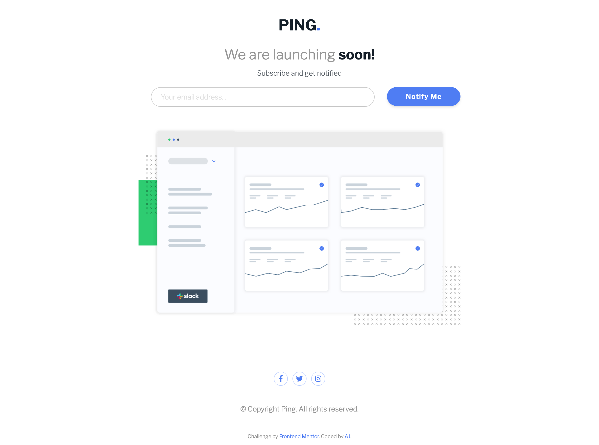

# Frontend Mentor - Products preview card component solution

This is a solution to the [Ping coming soon page challenge on Frontend Mentor](https://www.frontendmentor.io/challenges/ping-single-column-coming-soon-page-5cadd051fec04111f7b848da). Frontend Mentor challenges help you improve your coding skills by building realistic projects.

## Table of contents

- [Overview](#overview)
  - [The challenge](#the-challenge)
  - [Screenshot](#screenshot)
  - [Links](#links)
- [My process](#my-process)
  - [Built with](#built-with)
  - [What I learned](#what-i-learned)
  - [Continued development](#continued-development)
  - [Useful resources](#useful-resources)
- [Author](#author)
- [Acknowledgments](#acknowledgments)

## Overview

I am learning Tailwind CSS so built this using tailwind css.

### The challenge

Users should be able to:

- View the optimal layout for the site depending on their device's screen size
- See hover states for all interactive elements on the page
- Submit their email address using an `input` field
- Receive an error message when the `form` is submitted if:
  - The `input` field is empty. The message for this error should say _"Whoops! It looks like you forgot to add your email"_
  - The email address is not formatted correctly (i.e. a correct email address should have this structure: `name@host.tld`). The message for this error should say _"Please provide a valid email address"_

### Screenshot

The screenshot for desktop view:

The screenshot for the mobile view:

### Links

- Solution URL: [Products preview card](https://github.com/gtalin/front-end-mentor/ping-coming-soon)
- Live Site URL: [Products preview card](https://gtalin.github.io/front-end-mentor/ping-coming-soon)

## My process

### Built with

- Semantic HTML5 markup
- Mobile-first workflow
- [Tailwind CSS](https://tailwindcss.com/)
- Mobile-first workflow

### What I learned

**todo**

### Continued development

Would like to do more projects using tailwindcss. Would also like to focus more on accessibility.

### Useful resources

- [Tailwind docs](https://tailwindcss.com/docs/)
- [accessible buttons](https://www.sarasoueidan.com/blog/accessible-icon-buttons)
- [CSS tricks form validation](https://css-tricks.com/form-validation-ux-html-css/)
- [Form validation](https://medium.com/wdstack/inline-validation-in-forms-designing-the-experience-123fb34088ce)
- Google forms - The above medium article mentions google forms. It is actually a good resource to see the html markup for input field validation. They use an empty `div` which is hidden with `display:none`. When an input field validation message is to be displayed, another class with `display:flex` and some other styling css is added to the `div` which overrides the `display:none`. The text message in the `div` is added dynamically by JS depending on what message we want to show `required field` or very specific wrong field message (example for a password we might have some very specific requirements for which we might want to display a specific message). Also the `role` of that `div` is set to `alert`. Field validation for google forms is quite elaborate. We want to display a message once we start typing and then move focus away from that field. Apart from a message, there are other cues as well: the border of the container which houses the field becomes red. A red line appears below the input field.
- [Inline validation web forms](http://alistapart.com/article/inline-validation-in-web-forms/)

## Author

- Website - [AJ](https://github.com/gtalin)
- Frontend Mentor - [@gtalin](https://www.frontendmentor.io/profile/gtalin)
- Twitter - [@gtalinn](https://twitter.com/gtalinn)

## Acknowledgments

Learned a lot from the several resources listed above.
