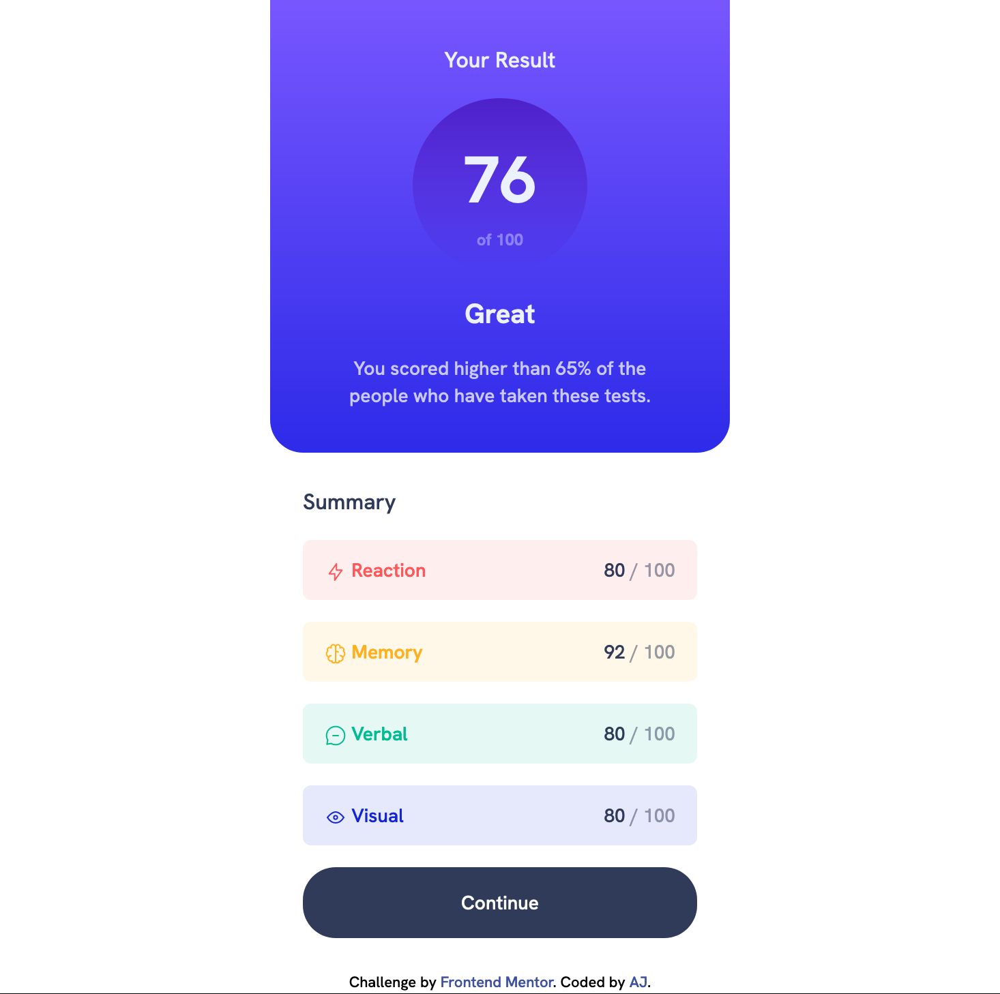
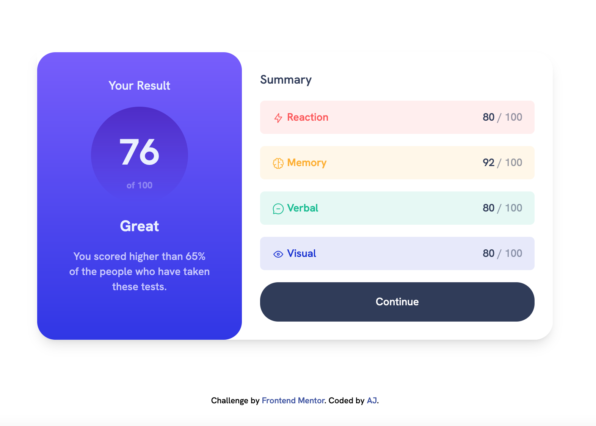

# Frontend Mentor - Results summary component solution

This is a solution to the [Results summary component challenge on Frontend Mentor](https://www.frontendmentor.io/challenges/results-summary-component-CE_K6s0maV). Frontend Mentor challenges help you improve your coding skills by building realistic projects.

## Table of contents

- [Overview](#overview)
  - [The challenge](#the-challenge)
  - [Screenshot](#screenshot)
  - [Links](#links)
- [My process](#my-process)
  - [Built with](#built-with)
  - [What I learned](#what-i-learned)
  - [Continued development](#continued-development)
  - [Useful resources](#useful-resources)
- [Author](#author)
- [Acknowledgments](#acknowledgments)

## Overview

I am learning Tailwind CSS so built this using tailwind css.

### The challenge

Users should be able to:

- View the optimal layout for the interface depending on their device's screen size
- See hover and focus states for all interactive elements on the page

### Screenshot

The screenshot for the mobile view:

The screenshot for the desktop view:

### Links

- Solution URL: [Results summary component](https://github.com/gtalin/front-end-mentor/tree/master/results-summary-component)
- Live Site URL: [Results summary component](https://gtalin.github.io/front-end-mentor/results-summary-component/build/)

## My process

### Built with

- Semantic HTML5 markup
- Mobile-first workflow
- [Tailwind CSS](https://tailwindcss.com/)

### What I learned

Learned how to setup tailwind css for an HTML project. Took some time getting used to the utilities first approach. But so far enjoying it quite a lot.

### Continued development

Would like to do more projetcs using tailwindcss. I have also done several other front end mentor design implementations which I would like to get deployed. Would also like to redo some of those projects using Tailwind css.

### Useful resources

- [Tailwind docs](https://tailwindcss.com/) - This helped me quickly search tailwind css properties.
- [Net Ninja tailwind css](https://www.youtube.com/playlist?list=PL4cUxeGkcC9gpXORlEHjc5bgnIi5HEGhw) - This helped me get an HTML based tailwind css project up and running. Also helped me get acquanited with a lot of tailwind css classes in a project based setting.
- [Tailwind CSS](https://www.youtube.com/watch?v=lCxcTsOHrjo&t=360s) - This course was particularly useful for getting a custom theme set up. Though tailwind has a lot of custom colors, most projects need their own colors and fonts setup.
- [Tailwind labs](https://www.youtube.com/tailwindlabs) - A lot of videos in here helped with grasping the utilities first approach. Before watching these videos I did not realise how convenient it was to never have to leave HTML while implementing the design.

## Author

- Website - [AJ](https://github.com/gtalin)
- Frontend Mentor - [@gtalin](https://www.frontendmentor.io/profile/gtalin)
- Twitter - [@gtalinn](https://twitter.com/gtalinn)

## Acknowledgments

Learned a lot from the several yotube resources listed above.
