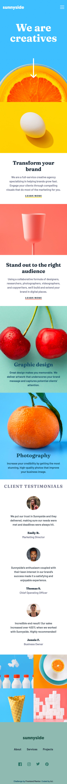

# Frontend Mentor - Products preview card component solution

This is a solution to the [Sunnyside agency landing page challenge on Frontend Mentor](https://www.frontendmentor.io/challenges/sunnyside-agency-landing-page-7yVs3B6ef). Frontend Mentor challenges help you improve your coding skills by building realistic projects.

## Table of contents

- [Overview](#overview)
  - [The challenge](#the-challenge)
  - [Screenshot](#screenshot)
  - [Links](#links)
- [My process](#my-process)
  - [Built with](#built-with)
  - [What I learned](#what-i-learned)
  - [Continued development](#continued-development)
  - [Useful resources](#useful-resources)
- [Author](#author)
- [Acknowledgments](#acknowledgments)

## Overview

I am learning Tailwind CSS so built this using tailwind css.

### The challenge

Users should be able to:

- View the optimal layout for the site depending on their device's screen size
- See hover states for all interactive elements on the page

### Screenshot

The screenshot for desktop view:


The screenshot for the mobile view:



### Links

- Solution URL: [Sunny Side agency landing page](https://github.com/gtalin/front-end-mentor/sunny-side-agency-landing-page)
- Live Site URL: [Sunny Side agency landing page](https://gtalin.github.io/front-end-mentor/sunny-side-agency-landing-page)

## My process

### Built with

- Semantic HTML5 markup
- Mobile-first workflow
- [Tailwind CSS](https://tailwindcss.com/)
- CSS Flexbox
- CSS Grid

### What I learned

- Various methods to change SVG color.
  To change the image color, without embedding SVG code in the `html` and using it only as an image, to change color, we can apply `filter`.
  The following works for our case:
  `filter:  brightness(0) invert(1);`

- We're making the triangle with `before` pseudo element. For larger screens though we have to remove that triangle.
  In CSS, to remove a `before` pseudo element, we can do `content: none`. :

```css
ul:before {
  content: none;
}
```

- If there is more than one navigation menu, then as per accessibility rules, we should use `aria-label` to identify each navigation menu. For reference, [link 1](https://www.w3.org/WAI/tutorials/page-structure/regions/) [link 2](https://www.w3.org/WAI/tutorials/menus/structure/)
  Another great [link](https://www.aditus.io/aria/aria-label/#example-3-multiple-navigation-landmarks) for `aria-label` usage.

We have 2 navigation elements on the page. One is in the `header` and other is in `footer`. The one in `header` is the `main` navigation element so we add an `aria-label` of `main` to it. And to the one in `footer`, we add an `aria-label` of `footer`.

- To add smooth scrolling to the page, used the property `scroll-behavior`. Added `scroll-behavior: smooth;` to `html`.

For browsers that do not support smooth scrolling, there is a [JS solution as well](https://css-tricks.com/snippets/jquery/smooth-scrolling/).

The native solution is preferred becuase if we implement smooth scrolling with JS, we might have to take care of `focus-changing` ourself. As is evident by the above mentioned link.
While implementing smooth scrolling though, it should be a good idea to disable it for people who have `prefers reduced motion set to true`. Or better still to enable it only for people who have not set `prefers-reduced-motion` to true. Because this property is not supported by all browsers, it is not a good idea to enable smooth scrolling for all and then disbale it for people who prefer reduced motion.

Applied `scroll-behaviour: smooth` for people with `prefers reduced motion` not set by using media query. Like so:

```css
@media (prefers-reduced-motion: no-preference) {
  html {
    scroll-behavior: smooth;
  }
}
```

The [motion preference media query](https://www.smashingmagazine.com/2021/10/respecting-users-motion-preferences/) link.

- Add a bounce animation to the down arrow. Again this one should be activated only for people with no preference set for `prefers reduced motion`. This is quite easy to do in tailwind css. There already is an inbuilt bounce animation with `animate-bouce` and we can apply it for people who have not set `prefers reduced motion` to `true`:
  `motion-safe:animate-bounce`

### Continued development

Would like to do more projects using tailwindcss. Would also like to focus more on accessibility.

### Useful resources

- [Tailwind docs](https://tailwindcss.com/docs/)
- [Change SVG color](https://stackoverflow.com/questions/22252472/how-can-i-change-the-color-of-an-svg-element)
- [filter image](https://stackoverflow.com/questions/52829623/how-to-make-a-color-white-using-filter-property-in-css)
- [Remove pseudo element](https://stackoverflow.com/questions/3012716/css-how-to-remove-pseudo-elements-after-before)
- [label to identify each navigation menu](https://www.w3.org/WAI/tutorials/page-structure/regions/)
- [menu structure](https://www.w3.org/WAI/tutorials/menus/structure/)
- [aria label examples](https://www.aditus.io/aria/aria-label/#example-3-multiple-navigation-landmarks)
- [smooth scrolling](https://css-tricks.com/snippets/jquery/smooth-scrolling/) I used the native browser solution for smooth scroll and not the JS solution. But it would be interesting to explore.
- [smooth scroll and accessibility](https://css-tricks.com/smooth-scrolling-accessibility/) The smooth scroll feature of the browser takes care of accessibility so this was not needed at the moment.
- [motion preference media query](https://www.smashingmagazine.com/2021/10/respecting-users-motion-preferences/)
- [Reduced motion media query](https://css-tricks.com/introduction-reduced-motion-media-query/)

## Author

- Website - [AJ](https://github.com/gtalin)
- Frontend Mentor - [@gtalin](https://www.frontendmentor.io/profile/gtalin)
- Twitter - [@gtalinn](https://twitter.com/gtalinn)

## Acknowledgments

Learned a lot from the several resources listed above.
